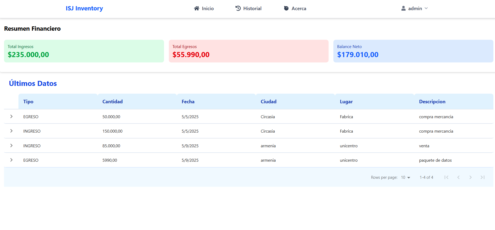

# 📊 Inventory-Software-Journal (ISJ)

**ISJ (Inventory of Stella and Jorge)** es un proyecto personal que nació de una necesidad familiar: ayudar a mis padres a organizar sus cuentas e ingresos/egresos de manera clara y sencilla.  
Este repositorio contiene el **frontend** del sistema, el cual funciona en conjunto con la API disponible aquí: 

👉 [ISJ](https://github.com/Pininita/ISJ)

Tambien dejo el **backend** que va en conjunto con el frontend:

👉 [ISJ-API](https://github.com/Pininita/ISJ-API)

Tambien dejare intrucciones de mi backend

---

## 🚀 Tecnologías
- React
- Apollo Client (GraphQL)
- Formik + Yup (validación de formularios)
- TailwindCSS
- Yarn

---

## ⚙️ Instalación y configuración

# ⚠️ ADVERTENCIA IMPORTANTE

**USAR ÚNICAMENTE LA RAMA `main`**

Este proyecto debe ejecutarse exclusivamente desde la rama `main`. Otras ramas pueden contener código experimental o inestable.

## Instalación correcta:

```bash
   git clone [URL_DEL_REPO]
   cd [NOMBRE_DEL_PROYECTO]
   git checkout main  # Asegúrate de estar en main
```

1. Clona este repositorio:  
   ```bash
   git clone https://github.com/Pininita/ISJ
   cd Inventory-Software-Journal
   ```

2. Instala dependencias:

    ```
    yarn
    ```

3. Configura las variables de entorno:
Crea un archivo .env en la raíz del proyecto y agrega:

    ```
    VITE_API_GRAPHQL_URL=http://localhost:8000/graphql/
    ```

4. Ejecuta el proyecto en modo desarrollo:

    ```
    yarn dev
    ```
---

✨ Funcionalidades

✅ Registro de transacciones (ingresos y egresos).

✅ Campos adicionales: ciudad, lugar y descripción.

✅ Cada usuario ve solo sus propias transacciones.

✅ Resumen financiero con:

    - Total de ingresos

    - Total de egresos

    - Balance neto

✅ Historial de transacciones.

---

📸 Capturas de pantalla




---


🔒 Limitaciones actuales

❌ No es posible eliminar ni editar transacciones desde el frontend.
(Solo puede hacerse desde el admin o la base de datos).

❌ No hay reportes gráficos diarios.

❌ API debe estar corriendo en local (aún no deployada públicamente).

---

🛠️ Próximas mejoras

Filtros de búsqueda para transacciones.

Reportes financieros más avanzados.

Deploy público de la API para no depender de un entorno local.


---
**ENGLISH VERSION**
---

# 📊 Inventory-Software-Journal (ISJ)

**ISJ (Inventory of Stella and Jorge)** is a personal project that was born from a family need: helping my parents organize their accounts, income, and expenses in a clear and simple way.  
This repository contains the **frontend** of the system, which works together with the API available here:

👉 [ISJ](https://github.com/Pininita/ISJ)

I’m also sharing the **backend** that works alongside the frontend:

👉 [ISJ-API](https://github.com/Pininita/ISJ-API)

I’ll also include instructions for the backend.

---

## 🚀 Technologies
- React
- Apollo Client (GraphQL)
- Formik + Yup (form validation)
- TailwindCSS
- Yarn

---


# ⚠️ IMPORTANT WARNING

**USE ONLY THE `main` BRANCH**

This project must be run exclusively from the `main` branch. Other branches may contain experimental or unstable code.

## Correct installation:

```bash
git clone [REPO_URL]
cd [PROJECT_NAME]
git checkout main  # Make sure you're on main
```
---

## ⚙️ Installation & Setup

1. Clone this repository:  
   ```bash
   git clone https://github.com/Pininita/ISJ
   cd Inventory-Software-Journal
   ```

2. Install dependencies:  
   ```bash
   yarn
   ```

3. Configure environment variables:  
   Create a `.env` file in the project root and add:

   ```bash
   VITE_API_GRAPHQL_URL=http://localhost:8000/graphql/
   ```

4. Run the project in development mode:  
   ```bash
   yarn dev
   ```

---

✨ Features

   ✅ Transaction registration (income and expenses).

   ✅ Additional fields: city, location, and description.

   ✅ Each user only sees their own transactions.

   ✅ Financial summary including:

       - Total income  
       - Total expenses  
       - Net balance  

   ✅ Transaction history.

---

📸 Screenshots

  


---

🔒 Current Limitations

   ❌ It’s not possible to delete or edit transactions from the frontend.  
   (This can only be done from the admin panel or directly in the database).  

   ❌ No daily graphic reports.  

   ❌ API must be running locally (not yet publicly deployed).  

---

🛠️ Upcoming Improvements

   - Transaction filters.  
   - More advanced financial reports.  
   - Public deployment of the API to avoid depending on a local environment.  

